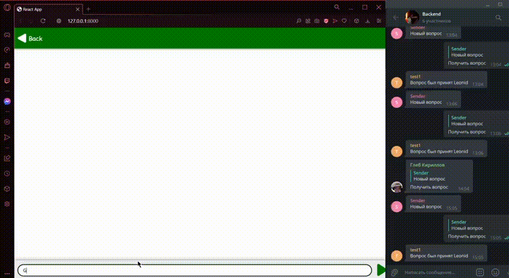

Seamless Support System
=======================
This is an implementation of a support service on Python, Django and React that can be easily integrated to different platforms. The service provides fast and efficient communication between user and volunteers in case of any questions. It is mainly based on implicitly connected telegram bot to the web page.

The repository includes:
Linter
Django App folder with front-end (React) and back-end part (Python)
Config file with constant data

The code is documented and designed to be easy to extend. If you use it in your research, please consider citing this repository (bibtex below). 

Functionality 
-------------
Users can refer to our integrated platform if they have some questions. The process is the following: user enters the QA field and in case of noticing the necessary question among the most frequently asked ones just click on it and get a fast answer. In another case, the user just types his/her question in a specific window and gets redirected to a dialog page, where can see all the answers below the questions. From the inner side, the process is more detailed and consists of resending the user’s question from the server to the common telegram chat with all the volunteers. There they can accept or reject the question, after this there forms a chat in telegram with a specific volunteer and a user. In the chat volunteer types the answer, pushes the “send” button and the message gets redirected back to the service and published on the page. 



Installation
-------------
Install Node.js
```bash
npm install
```

*Optional:*
This is optional, because it is only needed for the front-end part to work, but you can write the front-end yourself
In order to run the code on your device, go to the front-end folder and write the following in the terminal: 
```bash
npm run build
```

Additional information
-----------------------
**Linter:**
[](https://github.com/InnoSWP/B21-06-Seamless-support/actions/workflows/build.yml)


Licence
---------
MIT License

Copyright (c) 2022 Gleb Kirillov, Leonid Zelensky, Dilyara Farkhutdinova, Ali Mahmoud Mansour, Ernest Matskevich 

Permission is hereby granted, free of charge, to any person obtaining a copy
of this software and associated documentation files (the "Software"), to deal
in the Software without restriction, including without limitation the rights
to use, copy, modify, merge, publish, distribute, sublicense, and/or sell
copies of the Software, and to permit persons to whom the Software is
furnished to do so, subject to the following conditions:

The above copyright notice and this permission notice shall be included in all
copies or substantial portions of the Software.

THE SOFTWARE IS PROVIDED "AS IS", WITHOUT WARRANTY OF ANY KIND, EXPRESS OR
IMPLIED, INCLUDING BUT NOT LIMITED TO THE WARRANTIES OF MERCHANTABILITY,
FITNESS FOR A PARTICULAR PURPOSE AND NONINFRINGEMENT. IN NO EVENT SHALL THE
AUTHORS OR COPYRIGHT HOLDERS BE LIABLE FOR ANY CLAIM, DAMAGES OR OTHER
LIABILITY, WHETHER IN AN ACTION OF CONTRACT, TORT OR OTHERWISE, ARISING FROM,
OUT OF OR IN CONNECTION WITH THE SOFTWARE OR THE USE OR OTHER DEALINGS IN THE
SOFTWARE.


